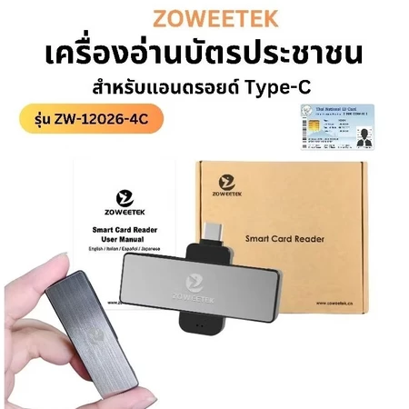

# Installation

## System Dependencies

pythaiidcard requires several system-level dependencies for PC/SC smartcard communication.

### Linux (Debian/Ubuntu)

```bash
sudo apt-get update
sudo apt-get install -y pcscd libpcsclite-dev python3-dev swig
```

**What these packages do:**

- `pcscd` - PC/SC Smart Card Daemon (manages smartcard readers)
- `libpcsclite-dev` - Development files for PC/SC Lite library
- `python3-dev` - Python development headers (required for pyscard compilation)
- `swig` - Interface compiler for Python bindings

### Other Linux Distributions

=== "Fedora/RHEL/CentOS"
    ```bash
    sudo dnf install -y pcsc-lite pcsc-lite-devel python3-devel swig
    ```

=== "Arch Linux"
    ```bash
    sudo pacman -S pcsclite swig python
    ```

=== "openSUSE"
    ```bash
    sudo zypper install pcsc-lite pcsc-lite-devel python3-devel swig
    ```

### Verify Installation

After installing system dependencies, verify that the PC/SC daemon is running:

```bash
sudo systemctl status pcscd
```

If it's not running, start it:

```bash
sudo systemctl start pcscd
sudo systemctl enable pcscd  # Enable on boot
```

## Python Package Installation

### Using pip (Recommended)

```bash
pip install pythaiidcard
```

### Using uv (Fast)

```bash
uv add pythaiidcard
```

### From Source

```bash
git clone https://github.com/ninyawee/pythaiidcard.git
cd pythaiidcard
uv sync --group dev
```

## Dependency Check

pythaiidcard automatically checks for required system dependencies on Linux systems. If dependencies are missing, you'll see a helpful error message:

```python
from pythaiidcard import ThaiIDCardReader

reader = ThaiIDCardReader()
# SystemDependencyError: Missing required system dependencies:
#
#   ✗ PC/SC Smart Card Daemon (pcscd)
#   ✗ PC/SC Lite development library (libpcsclite-dev)
#
# To install missing dependencies, run:
#
#   sudo apt-get update && sudo apt-get install -y pcscd libpcsclite-dev python3-dev swig
```

### Skipping the Check

If you've installed dependencies via other means or want to skip the check:

```python
reader = ThaiIDCardReader(skip_system_check=True)
```

## Hardware Setup

!!! info "Hardware Compatibility"
    Not all smartcard readers behave the same. Some readers have hardware limitations that may affect functionality. See [Hardware Compatibility](hardware-compatibility.md) for tested readers and known issues.

### Recommended Hardware

The library works with any PC/SC compatible smartcard reader. The author uses and recommends:

**USB-C Smart Card Reader**



- **Product**: USB-C Smart Card Reader
- **Link**: [Available on Shopee](https://s.shopee.co.th/9zpLTwW3c8) (affiliate link)
- **Features**:
  - USB-C connection
  - Compact and portable
  - Works with Thai National ID cards
  - PC/SC compatible
  - Plug and play on Linux

!!! info "Affiliate Disclosure"
    The Shopee link above is an affiliate link. The author may earn a commission from purchases made through this link at no additional cost to you.

!!! tip "Alternative Readers"
    Any PC/SC compatible smartcard reader will work, including:

    - Generic USB smartcard readers
    - Gemalto readers
    - ACS ACR122U
    - Built-in laptop smartcard readers

!!! warning "Known Limitations"
    **Alcor Link AK9563:** This reader has known limitations with auto-read functionality. It works perfectly in on-demand mode (default in v2.2.0+). See [Hardware Compatibility](hardware-compatibility.md#alcor-link-ak9563-alcor-micro) for details.

### Connect Your Smartcard Reader

1. Plug in your PC/SC compatible smartcard reader
2. Verify it's detected:

```bash
pcsc_scan
```

You should see output like:

```
PC/SC device scanner
V 1.6.2 (c) 2001-2022, Ludovic Rousseau <ludovic.rousseau@free.fr>
...
Reader 0: Generic USB Smart Card Reader
```

Press `Ctrl+C` to exit.

### Permissions (Optional)

If you encounter permission issues, add your user to the `scard` group:

```bash
sudo usermod -a -G scard $USER
```

Then log out and log back in for the changes to take effect.

## Verify Installation

Test that everything is working:

```python
from pythaiidcard import ThaiIDCardReader

# List available readers
readers = ThaiIDCardReader.list_readers()
for r in readers:
    print(f"Reader {r.index}: {r.name}")
    print(f"  Status: {'Card Present' if r.connected else 'No Card'}")
```

## Development Installation

For development with all optional dependencies:

```bash
# Clone the repository
git clone https://github.com/ninyawee/pythaiidcard.git
cd pythaiidcard

# Install with development dependencies
uv sync --group dev

# Install system dependencies
mise run install-deps  # If you have mise installed
```

### Development Tools

The development environment includes:

- **ruff** - Linting and formatting
- **streamlit** - Web UI for debugging
- **mkdocs-material** - Documentation generation

### Running Tests

```bash
# Run linting
uv run ruff check .

# Format code
uv run ruff format .

# Run the web UI
uv run streamlit run debug/app_compact.py
```

## Troubleshooting

See the [Troubleshooting](troubleshooting.md) guide for common installation issues.

## Next Steps

- [Hardware Compatibility →](hardware-compatibility.md) - Check your reader compatibility
- [Usage Guide →](usage.md) - Learn how to use the library
- [API Reference →](api-reference.md) - Detailed API documentation
